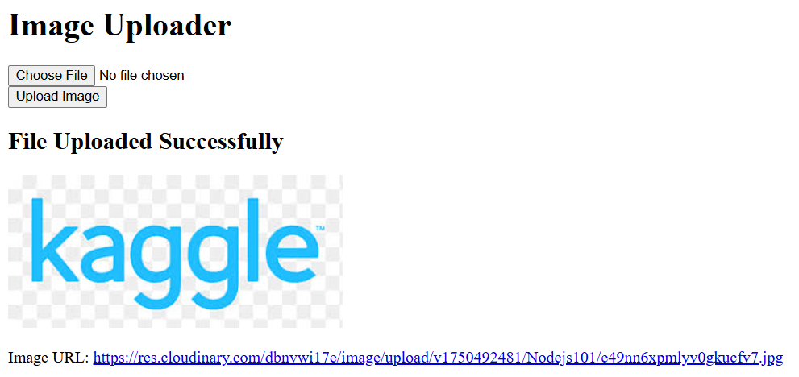
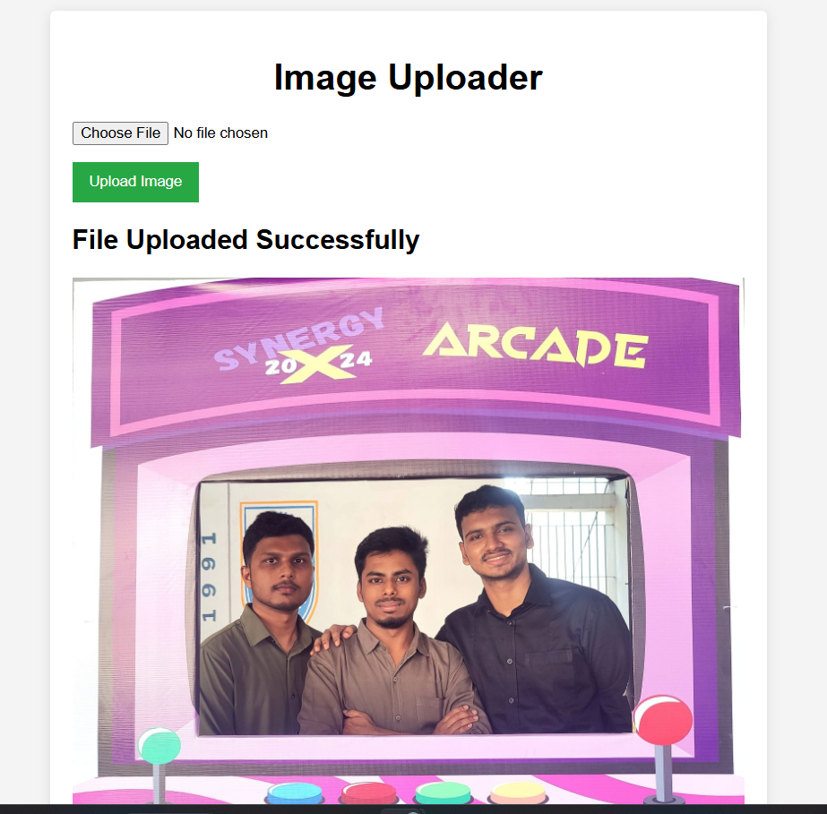
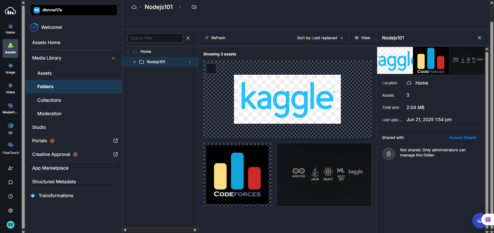
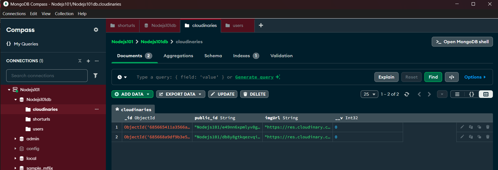

# 📦 Rest API Image Uploader using Multer & Cloudinary

    
    
    
    
    

---

## 🚀 Project Overview

A simple REST API for uploading images, built with **Node.js**, **Express**, **Multer**, and **Cloudinary**.  
Perfect for learning file uploads, cloud storage, and API design.

---

## 🛠️ Tech Stack

| Technology   | Role                      |
|--------------|---------------------------|
| **Node.js**  | Backend runtime           |
| **Express**  | Web framework             |
| **Multer**   | File upload middleware    |
| **Cloudinary** | Image cloud storage     |
| **dotenv**   | Env variable management   |

---

## 🧑‍💻 Key Learnings

- **REST API Design:** Structuring endpoints for file uploads.
- **Multer:** Handling `multipart/form-data` in Express.
- **Cloudinary:** Uploading and managing images in the cloud.
- **Validation:** Restricting uploads to images only.
- **Async/Await:** Managing async uploads with error handling.
- **Environment Variables:** Securing API keys with `.env`.
- **Testing:** Debugging endpoints with Postman.
- **Implemented environment variables** to securely manage and hide sensitive data (such as API keys and secrets) in the backend for the first time, following best practices

---

## 🌟 Challenges & Solutions

- **File Validation:** Ensured only images are accepted.
- **Cloudinary Setup:** Solved API key issues using docs and `dotenv`.
- **Testing:** Used Postman for endpoint verification.

---

## 📸 Screenshots

| Description                                   | Preview                                 |
|-----------------------------------------------|-----------------------------------------|
| 1. Interface without CSS                      |           |
| 2. Interface with CSS                         |         |
| 3. Files stored in Cloudinary                 |       |
| 4. Only essentials stored in the database     |         |

---

## 📂 Getting Started

1. **Clone the repo:**  
     `git clone <repo-url>`
2. **Install dependencies:**  
     `npm install`
3. **Configure environment:**  
     Create a `.env` file with your Cloudinary credentials.
4. **Start the server:**  
     `npm start`
5. **Test the API:**  
     Use Postman to send a `POST` request to `/upload` with an image file.

---

## 🙏 Acknowledgements

- [Multer Documentation](https://github.com/expressjs/multer)
- [Cloudinary Documentation](https://cloudinary.com/documentation)

---

> **Tip:** Screenshots are in the `screenshots/` folder. Replace them with your own if needed!
